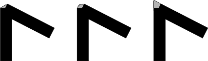

# cairo-gobject

Cairo binding for use with Gdk and Gtk widgets.
It is extension for compile-time generated bindings to "libcairo-gobject2" library.
This bindings is generated "gobject" shard (https://github.com/jhass/crystal-gobject).
I used mainly code from "cairo-cr" shard ,
so it is a fork "cairo-cr" shard (https://github.com/TamasSzekeres/cairo-cr)

## Installation

First install cairo:
```bash
sudo apt-get install libgirepository1.0-dev libgtk-3-dev libcairo-gobject2 gir1.2-freedesktop
```
Note: "crystal-gobject" uses *cairo-1.0.typelib* from *gir1.2-freedesktop* package for generating cairo bindings. Different versions of Ubuntu use different versions of *gir1.2-freedesktop* package. If you use Ubuntu18.04 based distributives uncomment *Rectangle* structure in *src/lib_cairo.cr* file (lines 7...12).  
If you use Ubuntu 20.04 LTS (Focal Fossa) based distributives need install *libevent-2.1-6* pkg :  
```sh
   sudo add-apt-repository "deb http://mirrors.kernel.org/ubuntu/ eoan main"
   sudo apt-get update
   sudo apt-get install libevent-2.1-6
```

1. Add the dependency to your `shard.yml`:

   ```yaml
   dependencies:
     cairo-gobject:
       github: viachpaliy/cairo-gobject
   ```

2. Run `shards install`

## Usage

```crystal
require "gobject/gtk"
require "cairo-gobject/cairo"
```
For more details see the sample in [/samples](/samples) folder.

## Samples

Run sample :
```shell
  cd cairo-gobject
  shards install
  crystal run samples/sample_name.cr
```

See also samples in :

- [gtk_custom_widgets](https://github.com/viachpaliy/gtk_custom_widgets) - Collection of custom widgets.
 
## Development

TODO: Write development instructions here

## Contributing

1. Fork it (<https://github.com/viachpaliy/cairo-gobject/fork>)
2. Create your feature branch (`git checkout -b my-new-feature`)
3. Commit your changes (`git commit -am 'Add some feature'`)
4. Push to the branch (`git push origin my-new-feature`)
5. Create a new Pull Request

## Contributors

- [viachpaliy](https://github.com/viachpaliy) - creator and maintainer

## Library specific shards

Here's a well known list of  them:

- [gtk_custom_widgets](https://github.com/viachpaliy/gtk_custom_widgets) - Collection of custom widgets.

## Introduction
Cairo-gobject is a Crystal shard for working with the Cairo library.
It is a set of Crystal bindings to the Cairo C library.
It closely matches the C API with the exception of cases, where more Crystal way is desirable.

### Cairo
Cairo is a library for creating 2D vector graphics. It is written in the C programming language.  
Bindings for other computer languages exist, including Python, Perl, C++, C#, or Java.  
Cairo is a multiplatform library; it works on Linux, BSDs, Windows, and OSX.   
Cairo supports various backends. Backends are output devices for displaying the created graphics.   
* X Window System
* Win32 GDI
* Mac OS X Quartz
* PNG
* PDF
* PostScript
* SVG
This means that we can use the library to draw on Windows, Linux, Windows, OSX  
and we can use the library to create PNG images, PDF files, PostScript files, and SVG files.   
We can compare the Cairo library to the GDI+ library on Windows OS and the Quartz 2D on Mac OS.  
Cairo is an open source software library. From version 2.8, Cairo is part of the GTK system.  

### Definitions
Here we provide some useful definitions. To do some drawing in Cairo, we must first create a drawing *context*.  
The drawing *context* holds all of the graphics state parameters that describe how drawing is to be done.  
This includes information such as line width, color, the surface to draw to, and many other things.  
It allows the actual drawing functions to take fewer arguments to simplify the interface. 

A *path* is a collection of points used to create primitive shapes such as lines, arcs, and curves.
There are two kinds of *paths*: open and closed *paths*. In a closed *path*, starting and ending points meet.  
In an open *path*, starting and ending point do not meet. In Cairo, we start with an empty *path*.  
First, we define a *path* and then we make them visible by stroking and/or filling them.  
After each `stroke` or `fill` method call, the *path* is emptied. We have to define a new *path*.  
If we want to keep the existing *path* for later drawing, we can use the `stroke_preserve` and `fill_preserve` methods.  
A *path* is made of subpaths. 

A *source* is the paint we use in drawing. We can compare the source to a pen or ink that we use to draw the outlines  
and fill the shapes. There are four kinds of basic *sources*: colors, gradients, patterns, and images. 

A *surface* is a destination that we are drawing to. We can render documents using the PDF or PostScript surfaces,  
directly draw to a platform via the Xlib and Win32 surfaces. 

Before the source is applied to the surface, it is filtered first. The *mask* is used as a filter.  
It determines where the *source* is applied and where not. Opaque parts of the *mask* allow to copy the *source*.
Transparent parts do not let to copy the *source* to the *surface*. 

A *pattern* represents a *source* when drawing onto a *surface*. In Cairo, a *pattern* is something  
that you can read from and that is used as the *source* or *mask* of a drawing operation.  
*Patterns* can be solid, surface-based, or gradients.

### GTK Window  
In the first example, we draw on a GTK window.  
This backend will be used throughout the rest of the tutorial. 
```cr
require "gobject/gtk/autorun"
require "../src/cairo"

class CairoApp
  @window : Gtk::Window
  

  delegate show_all, to: @window

  def initialize
    @window = Gtk::Window.new
    @window.title = "Simple drawing"
    @window.resize 600,150
    @window.connect "destroy", &->Gtk.main_quit
    darea = Gtk::DrawingArea.new
    darea.connect "draw",&->drawfun 
    @window.add darea
  end

  def drawfun
    context = Gdk.cairo_create(@window.window.not_nil!)
    context.set_source_rgb(0, 0, 100) 
    context.select_font_face("Sans", Cairo::FontSlant::NORMAL , Cairo::FontWeight::NORMAL)
    context.font_size=40 
    context.move_to(10,50)
    context.show_text("Cairo draw on a GTK window!")
  end

end

app=CairoApp.new
app.show_all
```
The example pops up a GTK window on which we draw the "Cairo draw on a GTK window!" text.

Gtk specifically has a convenience wrapper that starts the mainloop automatically:

```cr
require "gobject/gtk/autorun"
```
We import the Cairo module:

```cr
require "../src/cairo"
```
In the next line we create an empty window:

```cr
@window = Gtk::Window.new
```
We  tell it to set the value of the property title to "Simple drawing":

```cr
@window.title = "Simple drawing"
```
We set a size of window :
```cr
@window.resize 250,150
```
Followed by connecting to the window\92s delete event to ensure that   
the application is terminated if we click on the x to close the window:

```cr
@window.connect "destroy", &->Gtk.main_quit
```
We will be drawing on a Gtk.DrawingArea widget:

```cr
darea = Gtk::DrawingArea.new
```
When the window is redrawn, a `draw` signal is emitted.  
We connect that signal to the `drawfun` callback:

```cr
darea.connect "draw",&->drawfun
```
The drawing is done inside the `drawfun` method.  
We create a Cairo context from window :

```cr
context = Gdk.cairo_create(@window.window.not_nil!)
```
We draw our text in blue ink. The ink is specified with the `set_source_rgb` method:

```cr
context.set_source_rgb(0, 0, 100)
```
We choose a font type with the `select_font_face` method   
and set its size with the `set_font_size` method: 

```cr
context.select_font_face("Sans", Cairo::FontSlant::NORMAL , Cairo::FontWeight::NORMAL)
context.font_size=40 
```
We move to a position at x=10.0, y=50.0 and draw the text: 

```cr
context.move_to(10,50)
context.show_text("Cairo draw on a GTK window!")
```

### Fill and stroke

The `stroke` operation draws the outlines of shapes and the `fill` operation fills the insides of shapes.  
In the example, we draw a circle and fill it with a solid color. 

```cr
require "gobject/gtk/autorun"
require "../src/cairo"
require "math"

class CairoApp
  @window : Gtk::Window
  

  delegate show_all, to: @window

  def initialize
    @window = Gtk::Window.new
    @window.title = "Fill and stroke"
    @window.resize 400,300
    @window.connect "destroy", &->Gtk.main_quit
    darea = Gtk::DrawingArea.new
    darea.connect "draw",&->drawfun 
    @window.add darea
  end

  def drawfun
    context = Gdk.cairo_create(@window.window.not_nil!)
    context.line_width=9
    context.set_source_rgb( 0.69, 0.19, 0) 
    context.translate(200,150)
    context.arc(0,0,50,0,2*Math::PI)
    context.stroke_preserve
    context.set_source_rgb( 0.30, 0.40, 0.60)
    context.fill
  end

end

app=CairoApp.new
app.show_all
```

This module is needed for the pi constant which is used to draw a circle. 

```cr
require "math"
```

We set a line width with the `line_width=` method.
We set the source to some dark red color using the `set_source_rgb()` method. 

```cr
context.line_width=9
context.set_source_rgb( 0.69, 0.19, 0)
```

With the `translate()` method, we move the drawing origin to the center of the window.
We want our circle to be centered.

```cr
context.translate(200,150)
```

The `arc()` method adds a new circular path to the Cairo drawing context. 

```cr
context.arc(0,0,50,0,2*Math::PI)
```

Finally, the `stroke_preserve()` method draws the outline of the circle.
Unlike the `stroke()` method, it also preserves the shape for later drawing. 

```cr
context.stroke_preserve
```

We change the color for drawing and fill the circle with a new color using the `fill()` method.

```cr
context.set_source_rgb( 0.30, 0.40, 0.60)
context.fill
```

### Pen dashes

Each line can be drawn with a different pen dash. A pen dash defines the style of the line.
The dash pattern is specified by the `set_dash()` method.
The pattern is set by the dash list which is a list of floating values.
They set the on and off parts of the dash pattern.
The dash is used by the `stroke()` method to create a line.
If the number of dashes is 0, dashing is disabled.
If the number of dashes is 1, a symmetric pattern is assumed with alternating on 
and off portions of the size specified by the single value in dashes. 

```cr
  def drawfun
    context = Gdk.cairo_create(@window.window.not_nil!)
    context.set_source_rgb( 0.69, 0.19, 0) 
    context.line_width=1.5
    context.set_dash([4.0, 21.0, 2.0], 0)
    context.move_to(40, 30)
    context.line_to(200, 30)
    context.stroke 
    context.set_dash([14.0, 6.0], 0)
    context.move_to(40,50)
    context.line_to(200,50)
    context.stroke
    context.set_dash([1.0], 0)
    context.move_to(40,70)
    context.line_to(200,70)
    context.stroke
  end 
```

We draw three lines in three different pen dashes. 

```cr
context.set_dash([4.0, 21.0, 2.0], 0)
```

We have a pattern of three numbers. We have 4 points drawn, 21 not drawn, and 2 drawn,
then 4 points not drawn, 21 points drawn. and 2 not drawn.
This pattern takes turns until the end of the line. 

```cr
context.set_dash([14.0, 6.0], 0)
```

In this pattern, we have always 14 points drawn and 6 not drawn. 

```cr
context.set_dash([1.0], 0)
```

Here we create a pen dash of a symmetric pattern of alternating single on and off points.

### Line caps

The line caps are end points of lines.   
There are three different line cap styles in Cairo :
* Cairo::LineCap::SQUARE
* Cairo::LineCap::ROUND
* Cairo::LineCap::BUTT  
  
A line with a `Cairo::LINE_CAP_SQUARE` cap has a different size than a line with a `Cairo::LINE_CAP_BUTT` cap.
If a line is x units wide, the line with a `Cairo::LINE_CAP_SQUARE` cap will be exactly x units greater in size;
x/2 units at the beginning and x/2 units at the end. 

```cr
  def drawfun
    context = Gdk.cairo_create(@window.window.not_nil!)
    context.set_source_rgb( 0.3, 0.19, 0.4) 
    context.line_width=10
    context.line_cap=Cairo::LineCap::BUTT
    context.move_to(30, 50)
    context.line_to(150, 50)
    context.stroke 
    context.line_cap=Cairo::LineCap::ROUND
    context.move_to(30, 90)
    context.line_to(150, 90)
    context.stroke
    context.line_cap=Cairo::LineCap::SQUARE
    context.move_to(30, 130)
    context.line_to(150, 130)
    context.stroke
    context.line_width=1.5
    context.move_to(30, 40)
    context.line_to(30, 140)
    context.stroke
    context.move_to(150, 40)
    context.line_to(150, 140)
    context.stroke
    context.move_to(155, 40)
    context.line_to(155, 140)
    context.stroke
  end 
```

The example draws three lines with three different line caps.
It will also graphically demonstrate the differences in size of the lines by drawing three additional thin vertical lines.

```cr
 context.line_width=10
```

Our lines will be 10 px wide. 

```cr
  context.line_cap=Cairo::LineCap::ROUND
  context.move_to(30, 90)
  context.line_to(150, 90)
  context.stroke 
```

Here we draw a horizontal line with a `Cairo::LINE_CAP_ROUND` cap. 

```cr
 context.line_width=1.5
 context.move_to(30, 40)
 context.line_to(30, 140)
 context.stroke
```

This is one of the three vertical lines used to demostrate the differences in size.

### Line joins

The lines can be joined using three different join styles :
* Cairo::LineJoin::BEVEL
* Cairo::LineJoin::ROUND
* Cairo::LineJoin::MITER  


```cr
  def drawfun
    context = Gdk.cairo_create(@window.window.not_nil!)
    context.set_source_rgb( 0.3, 0.19, 0.4)
    context.line_width=14
    context.rectangle(30, 30, 100, 100)
    context.line_join=Cairo::LineJoin::MITER
    context.stroke 
    context.rectangle(160, 30, 100, 100)
    context.line_join=Cairo::LineJoin::BEVEL
    context.stroke
    context.rectangle(100, 160, 100, 100)
    context.line_join=Cairo::LineJoin::ROUND
    context.stroke
  end 
```

In this example, we draw three thick rectangles with various line joins. 

```cr
  context.line_width=14
```

The lines are 14 px wide. 

```cr
    context.rectangle(30, 30, 100, 100)
    context.line_join=Cairo::LineJoin::MITER
    context.stroke 
```

Here we draw a rectangle with cairo.LINE_JOIN_MITER join style. 
